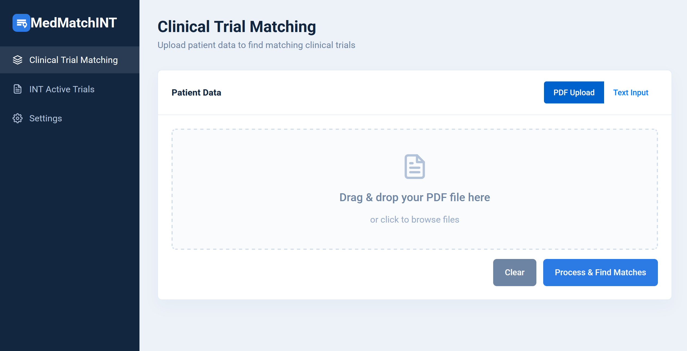

# MedMatchINT - Clinical Trial Matching System

This study introduced an explainable LLM-based system designed to address the challenge of matching
lung cancer patients with appropriate clinical trials. The system was developed with the objective of
streamlining the trial matching process by automatically extracting relevant clinical features from EHRs
and identifying eligible clinical trials while providing transparent explanations for the recommendations.

1. Start Ollama server and download the Mistral model or the model you want:

ollama serve &
ollama pull mistral

2. Create virtual env and clone this repository

3. Install Dependencies

pip install -r requirements.txt

4. Configure Environment
Compile the `.env` file with your configuration:

cp .env.example .env

2. Run the Flask application:

FLASK_APP=main.py FLASK_ENV=development flask run --host=0.0.0.0 --port=5000

### Privacy Note
This application processes all data in-memory only.
No files or patient data are saved to disk for privacy protection.

## 📊 Key Features

- PDF Processing and Analysis
- LLM-powered Analysis with Ollama (Mistral model)
- Clinical Trial Matching
- Secure File Handling

## 📝 Logs

Application logs are stored in:
- `logs/medmatchint.log`

